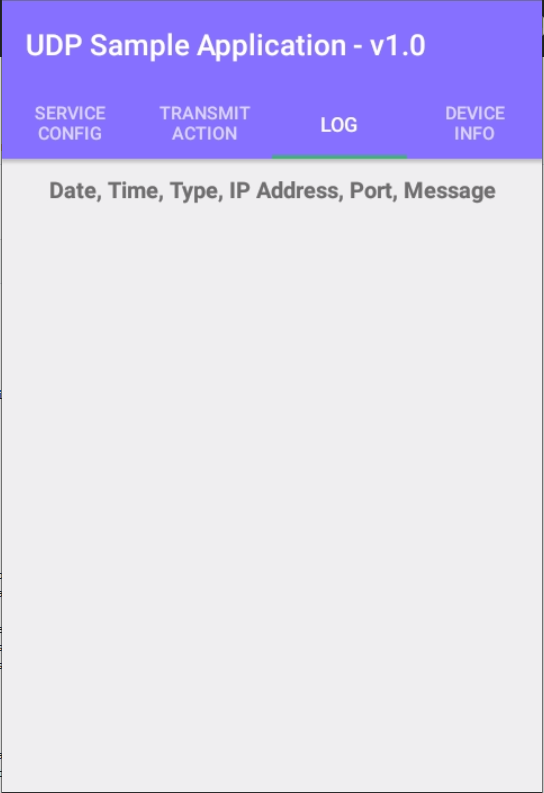

# UDP Sample Application

|Product|SmartHub/SmartTab/SmartCam/SmarTab8|
|-------|------------------------|
|Project|UDP Sample Application|
|Project Name|UDP Sample Application|
|Aim/Objective|An Android sample application that demostrates how the UDP transmit feature could be implemented on Micronet's computing platforms - SmartHub, SmarTab, SmartCam, and SmarTab8|
|Current Application Version| v1.0.0|
|Document Revision Number|02|
|Document Revision Date| 26 December 2019|

## Document History
|Document Revision|Written By|Date|Comments|
|-----------------|----------|----|--------|
|01|John Ho|19 December 2019|Draft|
|02|Eemaan Siddiqi|26 December 2019|Minor changes|

## Preface
### Document Purpose
The purpose of this document is to explain the functionality of the UDP Sample Application and to outline the standard implementation procedures required to establish a UDP communication channel through an AndroidTM application. 

## Introduction
### Background Information

This application was designed to implement a UDP communication channel for Micronet's computing platforms. The UDP communication channel would allow users to transmit and receive UDP messages from multiple parties. 
Using the sample application, users could configure the device to act as a Client or a Server. The application also allows users to choose between 2 party or 3 party communication.

|Develop Environment|Android Studio v3.5.3|
|-------------------|---------------------|
|Tested Model|Tab8: MsTab8/ SmartHub: TREQr_5/ SmartTab: MSTab8/ SmartCam: MSCAM|
|Tested OS|Tab8: msm8953_64_c801-userdebug 9 PKQ1/ SmartHub: TREQr_5_0.1.27.0_20190926.1451/ SmartTab: msm8953_64_c801-userdebug 9 PKQ1 micronet.MSTab8_00.2.7.0_20191119.0959 release-keys/ SmartCam: msm8953_64_c801-userdebug 9 PKQ1 micronet.MSCAM_10.2.7.0_20191118.1459 release-keys|
|Require Platform Keys and Properties|micronet-tab8-platform.keystore/ obc5_props.keystore/ obc5keys.properties/ tab8platformkey.properties|

### Application Feature and UI Instruction
Below are the application features and UI Instruction of the UDP Sample Application

Configuring a UDP Communication Channel (SERVICE CONFIG TAB)
-----
The application can be used to establish a UDP communication channel between multiple parties. To establish a communication channel, users are required to lock a configuration which inlcudes the following information: 


##### Communication Type
User can choose between 2 different communication types, 2 Parties and 3 Parties. 
2 Parties Communication allow user to test UDP transmit between the client and server.
3 Parties Communication allow user to perform UDP transmit between 2 Clients, and server will be a middle point to handle the UDP packets exchange by using UDP Hole Punching technique.


##### Client/Server Configuration
User will be able to configure a device to be either Client or Server.
When device set to be Server, it will require a static Sim card with a static IP address to perform the task.
On the other hand, When a device set to be Client, it only need to be connected to the Internet. It can be running on a cellular network or WIFI.

Server will act as a middle point in 3 parties communication, it 
Client will be able to send and receive UDP packets from Server or Clients on the other end.

##### Device IP
This section is displaying the current device's IP address, if the device has not Internet connection, it will display "N/A".

##### Target IP
No matter user are performing 2 parties or 3 parties communication, when device set to be Client, user needs to enter the IP address of the Server for UDP transmit.

##### Target Port
User needs to enter the port number before performing UDP transmit. For the best results, user should set the port number to be a 4 - 5 digit number within the Dynamic ports range(49152 to 65535).
When user performing 2 parties communication, the port number for both Client and Server has to be the same.
In the case of 3 parties communication, Client 1 port number has to be the same as Server. Client 2 port number needed to be increase by 1. 
Example: In 3 parties communication, when Client 1 and Server are opening port 7500, then Client 2 needs to open the port 7501.

##### LOCK CONFIG Button
Once user finishing the configuration setup, press the LOCK CONFIG button to secure the input and the configuration section will become unchangeable.

##### RESET CONFIG
Passing this button will remove all the user inputs and makes the configuration section available to editing.

Performing UDP Transmit (Transmit Action Tab) 
-----
In this tab, user will be able to enter a UDP message and start performing UDP transmit.


##### Target IP
This section is displaying the Server IP address from the configuration setting.

##### Target Port
This section displays the currently opening port number for UDP transmit.

##### Connection
This section displays the current Internet connectivity status.
ONLINE -- Device is connected to the network
OFFLINE -- Device is not connected to the network

Connectivity status will be updating in real-time, if it shows OFFLINE, please check the device internet connection.

##### Message
When device set to be Client, user can enter a text message here for UDP transmit. This message will be send over to Server or other Clients, depends on the communication type.

##### Time Gap SeekBar
When user performing UDP Cycle, they can set the time interval between each transmit, from every 1 second to every 1 minute.
default is set to be 1 second.

##### UDP Cycle Toggle Button
After user insert the text message and time interval, pressing the toggle button will start the UDP Cycle. Pressing the toggle button again during UDP cycle will stop the process.

##### UDP Send Button
Press this Send button will perform UDP transmit and sending one packet to the target.

##### TX
This section will display the current out-going UDP transmit

##### RX 
This section will display the current incoming UDP transmit

##### TX/RX Log format
When user performs any UDP transmit action, system displays a log message at the TX or RX TextView for the results of the action. 
Following are the format of the log message:

### Date, Time, Type, Target IP, Target Port, Text Message

|------------|-----------|
|Date Format:| YYYY-MM-DD|
|Time Format:| HH:MM:SS|
|Type Format:| SEND -- Out-going Transmit, REVEICED -- Incoming Transmit, Fail -- Unsuccessful Transmit|
|Target IP:| IPv4 Standard|
|Target Port:| 4 - 5 Digit Number|
|Text Message:| User Custom Text Message|

When no action detected, TX/RX TextView shows "N/A"

##### Example: 


Display UDP Transmit Record (Log Tab)
-----

Device Besic Information (DEVICE INFO Tab)
-----

Error Handling and Backup Mechanisms
-----
##### KeepAlive Mechanisms

##### Log Record

### Application Feature
Below are the application features of the UDP Sample App

### UDP Transmit
#### Client
Device will perform as Client, User needs to enter designated Server IP Address, Port Number and Text Message for sending UDP transmit.
Client will also be able to receive response from Server or other Client

**Device will perform as Client. User needs to enter the designated Server IP address and Port number, then press Lock Config button on the UI

#### Server
Device will perform as Server, User needs to enter opening port for receiving UDP transmit

#### 2 Parties Communication
This is a Client to Server Communication. One device will be setup as Client, another device will be setup as Server.
Client will send UDP transmit to Server and wait for response.
Server will receive UDP transmit and send response to Client.

#### 3 Parties Communication 
This is a Client to Client Communication. Client One will send UDP transmit to Server, and Server will pass the packet to Client Two on the other end.

#### UDP Cycle
When UDP Cycle is on, Client will continuously sending UDP transmit to Server/ Client, user will also be able to set a time gap for each sending during cycle(From 1 second to 1 minute) 

### Keep Alive Mechanism
Keep Alive Mechanism is an approach to evaluate and maintain Internet connection of the device once the system starts UDP transmit process.

Example: Server will open another listening port behind the system, it keeps receiving heartbeat UDP packet (1 byte)from client, and send an ack back to the sender.
If server did not receive any heartbeat packet from client, it will automatically increases the Error Count by 1.
When the number of Error Count reaches the configurable limit (Default set to 10), Server will activate "Internet Re-Connection".

Note: To prevent unwanted Internet Reconnection happens, any successful heartbeat communication cycle occurs during the error counting will reset the number of Error Count to 0.

#### Internet Reconnection
When the number of Error Count reaches the limit, system will automatically send an command to the device and force it to re-establish Internet connection by turning OFF and ON the network.
The number of Error Count will be reset to 0 after the process.

Note: Changing the Network state of the device requires System Permission. 

### UDP Transmit Log Display
When UDP Transmit processing, each sending and receiving record will be logged and displayed on the Log tabs in real-time.
Each log contains information of:

|Date|Time|Type|IP|Port|Text Message|
|----|----|----|--|----|------------|

### Write Log Into File
When system starts running on device, it creates new folder called "UDP_Log" in the device storage for saving UDP transmit log.
Each time the device perform an UDP transmit, it will also create a new csv file to store the transmit record.
The csv file which contains transmit record will be named as Year_Month_DateTHours_Minutes_Second.csv

Example: csv file named 2017_07_23T16_37_34.csv means the file was created on the date 07/23/2017 at 4pm.


### Read Device Hardware and Software Information 
System will extract device information
These information included the following:

|OS Version|Current Device version|
|----------|----------------------|
|Android Build Version|Current Android OS version|
|Device Model|Device's production model|
|Device Name|Device's produce name|
|Serial|Serial number of the device|
|App Version|Current version of the application|
|Hardware Library Version|Not Available|
|Vehicle Bus Library Version|Not Available|

### Read Device Connectivity Information
System will extract device's Network Connectivity information and update them on UI in real-time.
These information included the following:

|Name|Purpose|
|----|-------|
|Device IP|Detect device's current IP address|
|Sim State|Detect sim card stats of the device |
|Single Strength|Detect the current single strength of the network connectivity|
|Internet State|Detect device Internet capability|
|Phone Number|Extract phone number of the sim card(Only when sim card inserted)|
|IMEI|Extract device IMEI number|


### Future Feature
Set up a 3rd-party server (Amazon Cloud, Google Firebase and such) for user to preform UDP transmit and UDP transmit log storage.

## User Interface
### Graphical User Interface
The graphical user interface is tab with a standard Android header.

-----

### SERVER CONFIG Tab
#### Vertical Layout

#### Landscape Layout Part 1

#### Landscape Layout Part 2


Note: After user entered required information, and press Lock Config button. The radio buttons and edit text filed will be disable for editing, this is to prevent any changes during the UDP transmit process.

-----

### TRANSMIT ACTION Tab
#### Vertical Layout

#### Landscape Layout


-----

### LOG Tab
#### Vertical Layout

#### Landscape Layout


-----

### DEVICE INFO Tab
#### Vertical Layout

#### Landscape Layout


-----
### Application Setup

#### Preparation
Before you start, make sure the device that you'd like to setup as a Server is running on the static sim card and having a static IP.

For the Clients, they can be running on any kind of cellula network or connected to the WIFI.

#### Performing 2 Parties Communication
##### Client
At the SERVICE CONFIG Tab, select 2 parties for the Communication Type and Client for the Device Type. Enter the target server IP and designated port number, than press LOCK CONFIG.
Once user press LOCK CONFIG, the UI elements will be locked and become unchangeable. User can press RESET CONFIG to unlock the UI elements.
Switch to the TRABSMIT ACTION Tab, user will enter message, than press SEND or start a UDP cycle.
The TX will display out-going UDP transmit, and RX will display the incoming UDP transmit.
LOG Tab will produce the UDP transmit log record in real-time.

##### Server
At the SERVICE CONFIG Tab, select 2 parties for the Communication Type and Server for the Device Type. Enter the designated port number(Same as the Client), than press LOCK CONFIG,
Once user press LOCK CONFIG, the UI elements will be locked and become unchangeable. User can press RESET CONFIG to unlock the UI elements.
After LOCK CONFIG is pressed, the server will start listening for UDP transmit

#### Performing 3 Parties Communication
##### Client 1
At the SERVICE CONFIG Tab, select 3 parties for the Communication Type and Client for the Device Type. Enter the target server IP and designated port number, than press LOCK CONFIG.
Once user press LOCK CONFIG, the UI elements will be locked and become unchangeable. User can press RESET CONFIG to unlock the UI elements.
Switch to the TRABSMIT ACTION Tab, user will enter message, than press SEND or start a UDP cycle.
The TX will display out-going UDP transmit, and RX will display the incoming UDP transmit.
LOG Tab will produce the UDP transmit log record in real-time.

##### Client 2
At the SERVICE CONFIG Tab, select 3 parties for the Communication Type and Client for the Device Type. Insert the target server IP and designated port number, than press LOCK CONFIG.
Once user press LOCK CONFIG, the UI elements will be locked and become unchangeable. User can press RESET CONFIG to unlock the UI elements.
Switch to the TRABSMIT ACTION Tab, user will enter message, than press SEND or start a UDP cycle.
The TX will display out-going UDP transmit, and RX will display the incoming UDP transmit.
LOG Tab will produce the UDP transmit log record in real-time.

(** Note: For Client 2, please set the port number to be the Client 1 port plus 1.
Example: If Client 1 port number is set to 7501, Client 2 port number need to be set as 7502)

##### Server
At the SERVICE CONFIG Tab, select 3 parties for the Communication Type and Server for the Device Type. Enter the designated port number(Same as the Client 1), than press LOCK CONFIG,
Once user press LOCK CONFIG, the UI elements will be locked and become unchangeable. User can press RESET CONFIG to unlock the UI elements.
After LOCK CONFIG is pressed, the server will start listening for UDP transmit


### UDP Transmit Logic
#### DatagramSocket
The system use DatagramSocket for sending and receiving UDP packet, also it needs to setup a DatagramPacke structurer for reading the packet context.
Some of the basic logic such as:

Create a new DatagramSocket: DatagramSocket datagramSocket = new DatagramSocket(Port Number);
Create a new DatagramPacket: DatagramPack datagramPacket = new DatagramPacket(Packet, Packet Length, IP, Port);

Note: Base on different needs, the setup for DatagramSocket and DatagramPack could be differ, please see down below link for detailed reference.

Example of DatagramSocket on Server side:

```java
  try{
      DatagramSocket datagramsocket = new DatagramSocket(portNumner);
      DatagramPacket datagramPacket = new DatagramPacket(receiveData, receiveData.length)
      datagramSocket.receive(datagramPacket);
  }catch(Exception e){
  
  }

```

DatagramSocket: https://developer.android.com/reference/java/net/DatagramSocket

DatagramPacket: https://developer.android.com/reference/java/net/DatagramPacket

The benefit of using DatagramSocket and DatagramPacket in UDP transmit is to make the target address traceable. Since, unlike TCP, UDP communication protocol will not guarantee the packet delivery, 
there will be no solid communication channel created if two end points are performing UDP transmit. This problem is quite obvious especially when devices are using dynamic network connection, such as mobile network.

DatagramSocket and DatagramPacket will be able to mark down the network information of the device and those info will be packed and send with the UDP packet. 
User can decode the received UDP packet, extract those information and locate the sender network address.

Note: Thanks to the limitation of IPv4 and complexity of NAT, the network information you received from a UDP packet could be expired pretty soon.

#### UDP Hole Punching
The system is using the logic of UDP Hole Punching to perform the UDP transmit between Clients and Server. The basic idea of UDP Hole Punching is to setup a middle point (The Server)
which will listening to both end points (The Clients) and handling the UDP packet exchange.

You can find detailed information here:  https://en.wikipedia.org/wiki/UDP_hole_punching


